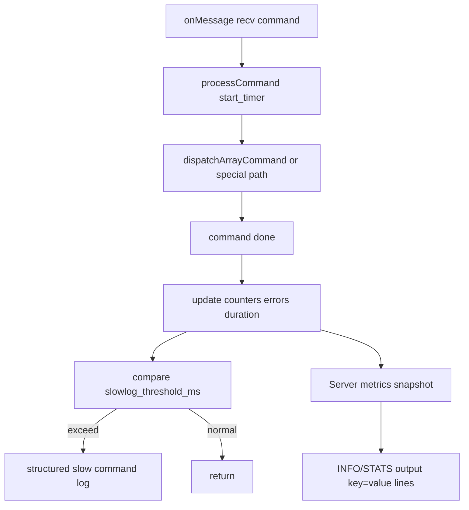

# SunKV 第3周可观测性增强方案

## 目标与约束
- 目标：完成你路线图中 Day1~Day5 的可观测性闭环。
- 约束：
  - INFO 输出延续当前 `key=value` 行格式。
  - 慢命令日志第一版覆盖**所有命令**。
  - 不改变现有命令语义，优先最小侵入落地。

## 方案总览

## Day1：指标清单定义（落地到字段）
- 在 [server/Server.h](/home/xhy/mycode/SunKV/server/Server.h) 增加可观测性状态：
  - 命令总计、错误总计、慢命令总计。
  - 命令累计耗时（可计算均值），可选近窗口最大耗时。
  - 输入缓冲水位（当前/峰值），输出缓冲关键水位（先用可拿到的数据）。
  - Pub/Sub 指标（频道数、订阅关系数、发布次数、投递次数）。
- 在 [common/Config.h](/home/xhy/mycode/SunKV/common/Config.h) 与 [common/Config.cpp](/home/xhy/mycode/SunKV/common/Config.cpp) 增加配置项：
  - `enable_slowlog`
  - `slowlog_threshold_ms`

## Day2：埋点接入（命令入口/异常）
- 在 [server/Server.cpp](/home/xhy/mycode/SunKV/server/Server.cpp) 的 `processCommand` 增加统一计时与埋点：
  - 入口记录开始时间，退出时统一上报耗时。
  - 识别错误响应路径并累计 `command_error_total`。
  - 统一记录命令名（数组命令/简单字符串命令都覆盖）。
- 抽象 `recordCommandMetrics(cmd_name, duration_ms, is_error)` 小函数，降低主流程复杂度。

## Day3：慢命令日志（全命令覆盖）
- 在 `processCommand` 统一出口进行阈值判断：`duration_ms >= slowlog_threshold_ms`。
- 输出结构化日志字段（单行）：
  - `cmd=<name>` `duration_ms=<x>` `peer=<ip:port>` `is_error=<0/1>` `in_multi=<0/1>` `subscribe_mode=<0/1>`。
- 开关行为：
  - `enable_slowlog=false` 时仅统计不打印。

## Day4：压测对照方案
- 复用 [scripts/redis_benchmark_stable.sh](/home/xhy/mycode/SunKV/scripts/redis_benchmark_stable.sh) 做前后对照：
  - 基线：当前 main（可观测性改动前）
  - 新版：可观测性改动后
- 指标对比维度：
  - SET/GET `P=1`、`P=16` 的 requests/sec 与 p50。
  - 慢日志开关前后吞吐变化（开关默认关闭，验证开时影响）。
- 结果沉淀为 markdown（沿用现有日志/summary 目录习惯）。

## Day5：文档沉淀
- 在 [README.md](/home/xhy/mycode/SunKV/README.md) 增加可观测性段落：
  - INFO 指标说明（key 列表）。
  - 慢日志配置与示例。
- 在 [doc/SunKV_四周功能扩展与交付路线图_20260420.md](/home/xhy/mycode/SunKV/doc/SunKV_四周功能扩展与交付路线图_20260420.md) 对应周目标处补“完成定义/复现命令”。
- 在现有对比文档中加入“可观测性章节”（指标解释 + 压测对照结论）。

## 测试与验收
- 新增/补充 server 集成测试（目录：[test/server/](/home/xhy/mycode/SunKV/test/server/)）：
  - INFO 包含新增指标 key。
  - 慢日志阈值触发路径（可通过注入低阈值 + 人工延迟命令模拟）。
  - 异常命令计数增长验证。
- 回归：
  - `ctest --test-dir build -L server --output-on-failure`
  - 压测脚本对照一轮。

## 风险与规避
- `processCommand` 复杂度继续上升：
  - 通过提取 metrics/slowlog helper 规避，保持主逻辑可读。
- 输出缓冲水位可观测性受现有接口限制：
  - 第一版先记录可获取值，必要时在 `TcpConnection` 增加只读 getter。
- 慢日志开关默认关闭，避免默认性能回退。