# SunKV 项目架构设计文档

## 1. 文档目标与范围

本文面向“完整项目设计说明”场景，覆盖 SunKV 的：

- 总体架构
- 模块分层与职责边界
- 核心调用链（启动、请求处理、写入、恢复、关闭）
- 持久化机制（WAL + Snapshot）
- 观测性、测试与 CI 工程化链路

核心代码目录：

- `server/`
- `network/`
- `protocol/`
- `storage2/`
- `client/`
- `common/`
- `test/`
- `scripts/`

---

## 2. 总体架构

### 2.1 总体分层图

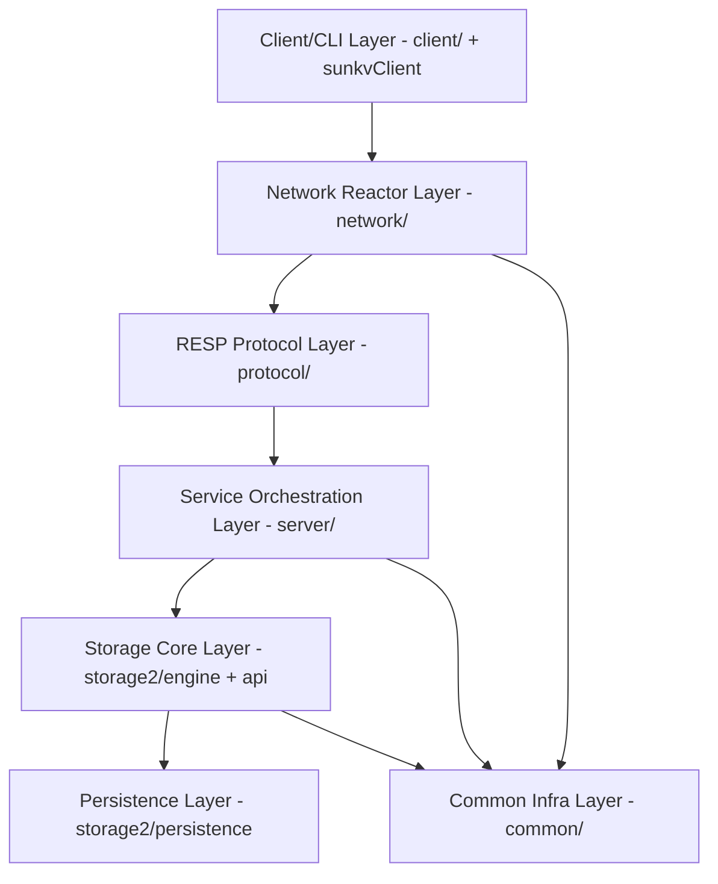

### 2.2 运行时组件图

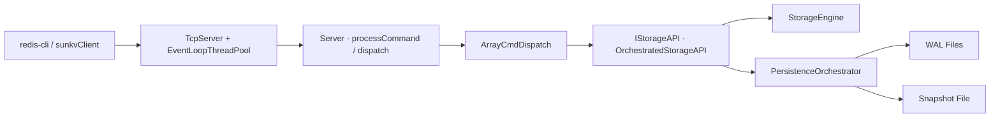

---

## 3. 模块架构与职责

## 3.1 `server/`（服务编排层）

职责：

- 生命周期管理（启动、停止、优雅关闭）
- 网络回调绑定（连接、消息、写完成）
- RESP 请求级流程控制（事务态、订阅态、命令门禁）
- 命令分发到 `ArrayCmdDispatch`
- 观测指标统计与慢命令日志

关键文件：

- `server/main.cpp`
- `server/Server.h`
- `server/Server.cpp`
- `server/ArrayCmdDispatch.h`
- `server/ArrayCmdDispatch.cpp`

### `server/` 内部结构图

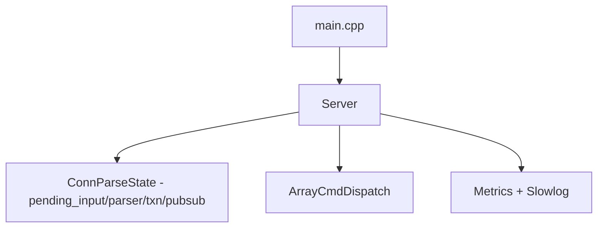

## 3.2 `network/`（网络与并发底座）

职责：

- 多线程 Reactor（EventLoop + Poller + Channel）
- 连接接入（Acceptor）
- 连接对象生命周期（TcpConnection）
- 输入/输出缓冲（Buffer）
- 回调桥接到 `server`

关键文件：

- `network/EventLoop.*`
- `network/Poller.*`
- `network/Channel.*`
- `network/Acceptor.*`
- `network/TcpServer.*`
- `network/TcpConnection.*`
- `network/Buffer.*`

### 网络层类关系图

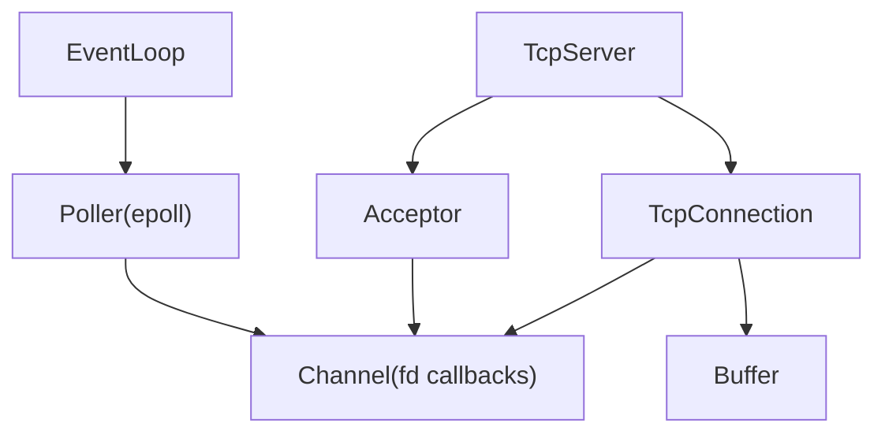

## 3.3 `protocol/`（RESP 协议层）

职责：

- 增量解析 RESP（支持半包/粘包/多命令）
- 响应序列化（simple string/error/bulk/integer/array）

关键文件：

- `protocol/RESPParser.*`
- `protocol/RESPSerializer.*`
- `protocol/RESPType.*`

### 协议处理图

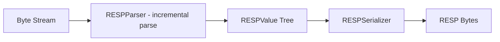

## 3.4 `storage2/`（存储与持久化核心）

职责：

- 数据模型与命令语义（string/list/set/hash + TTL）
- 变更抽象（MutationBatch）
- 持久化编排（WAL、Snapshot、恢复）
- 工厂组装（Factory）

关键子模块：

- `storage2/engine/`
- `storage2/model/`
- `storage2/persistence/`
- `storage2/decorators/`
- `storage2/Factory.*`

### `storage2` 分层图

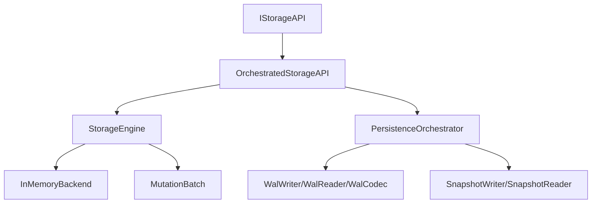

## 3.5 `client/`（客户端层）

职责：

- 连接服务端
- 命令封装（typed API + pipeline）
- RESP 客户端编解码

关键文件：

- `client/include/Client.h`
- `client/src/Client.cpp`
- `client/sunkvClient.cpp`

---

## 4. 关键调用链设计

## 4.1 服务启动调用链

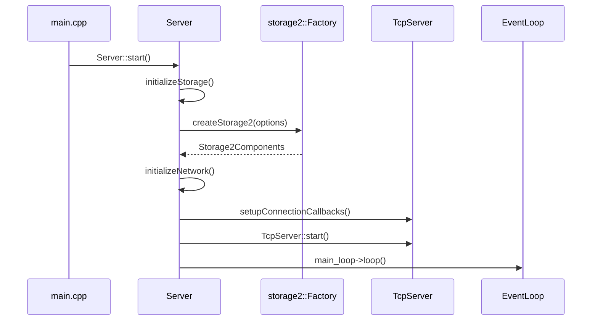

## 4.2 单请求处理调用链（收包到回包）

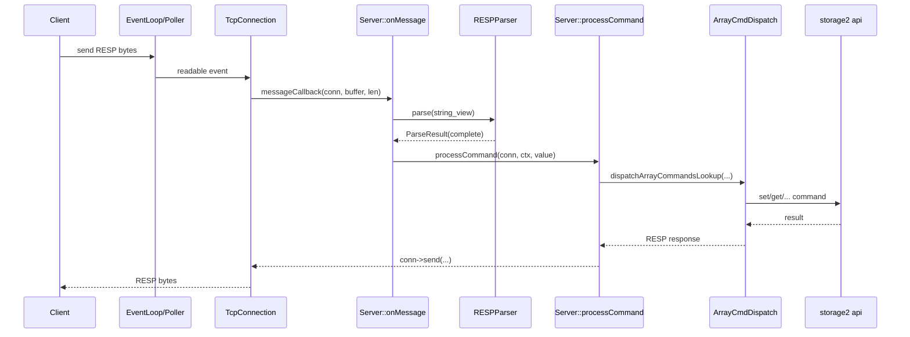

## 4.3 事务调用链（MULTI / EXEC）

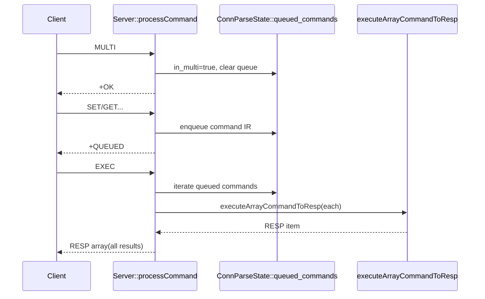

## 4.4 Pub/Sub 调用链

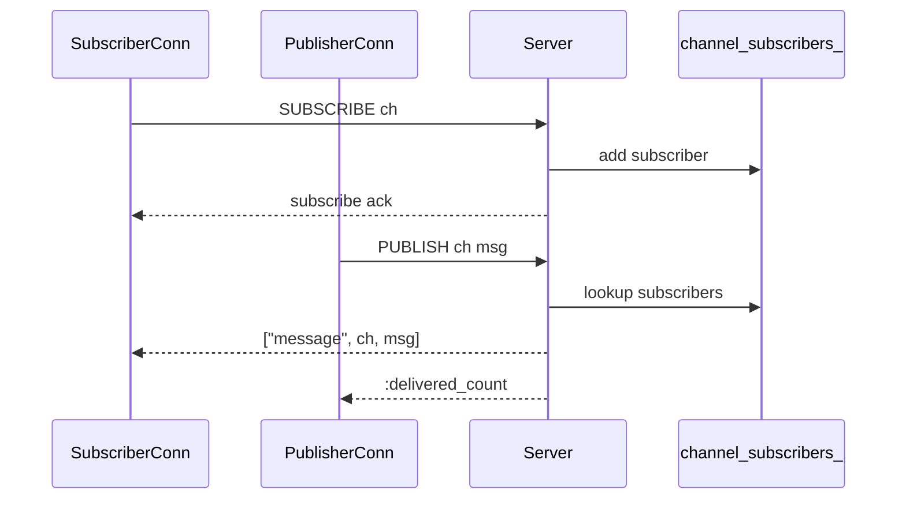

## 4.5 写入持久化调用链（含异步队列）

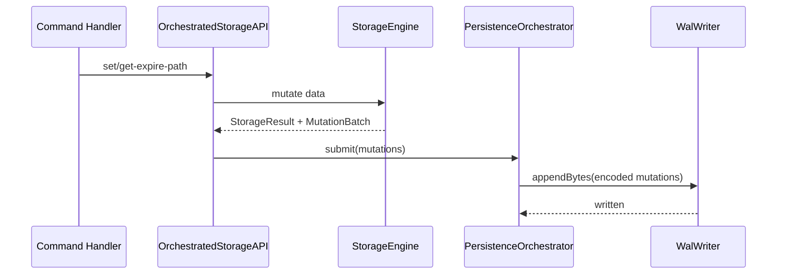

## 4.6 恢复调用链（Snapshot -> WAL）

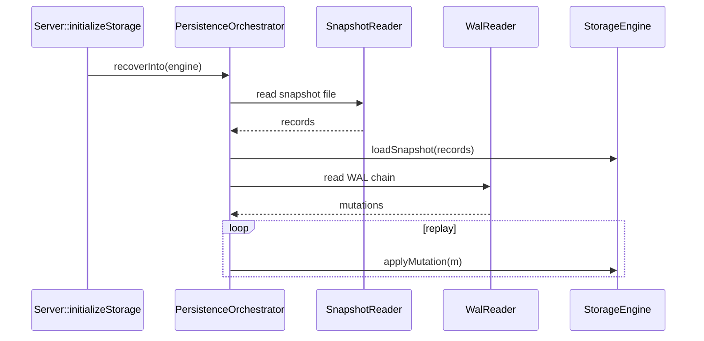

## 4.7 关闭调用链（优雅关闭）

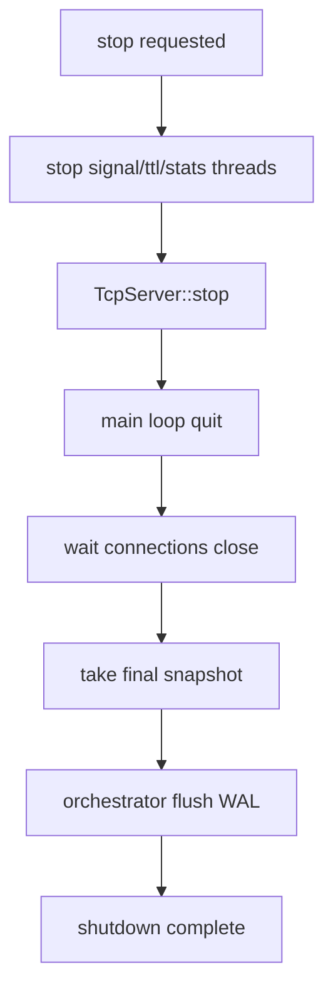

---

## 5. 观测性架构

核心内容：

- 命令耗时统计（累计与最大）
- 错误命令计数
- 慢命令计数与结构化日志
- Pub/Sub 指标（频道数、订阅关系数、发布数、投递数）
- `STATS/MONITOR/DEBUG INFO` 统一输出 `key=value`

### 观测数据采集图

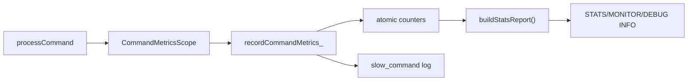

---

## 6. 工程化交付架构

## 6.1 测试架构图

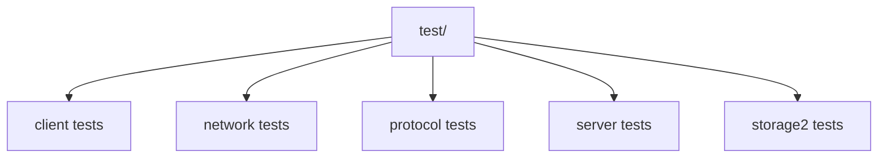

## 6.2 CI 分层图（fast/full）

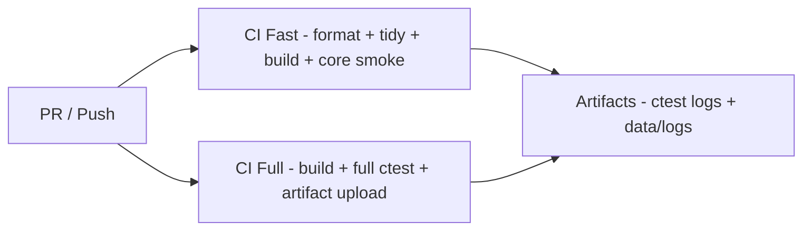

## 6.3 演示与交付链路图

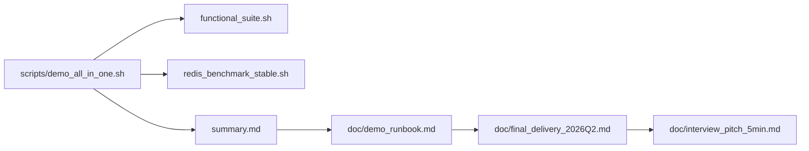

---

## 7. 架构关键设计原则

- 分层清晰：网络/协议/业务/存储/持久化职责分离
- 增量解析：面向真实网络半包粘包与 pipeline 场景
- 语义优先：事务、Pub/Sub、TTL 等行为与错误路径可验证
- 可恢复性：Snapshot + WAL 双层恢复链路
- 可观测性：命令级埋点和结构化慢日志
- 可交付性：测试分层、CI 分层、演示脚本和文档闭环

---

## 8. 建议的后续演进图（Roadmap）

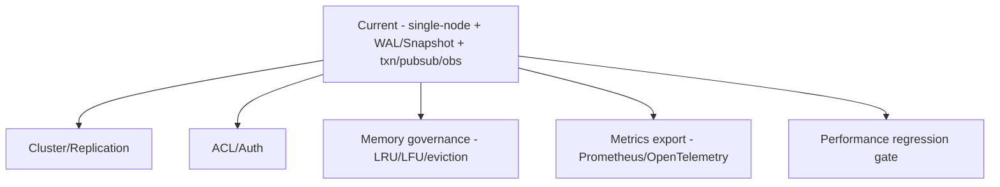

本文档可作为项目评审、面试讲解、二次开发设计输入的统一基线文档。
