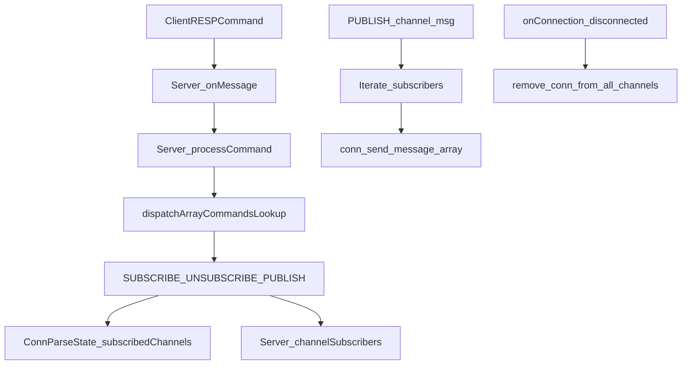
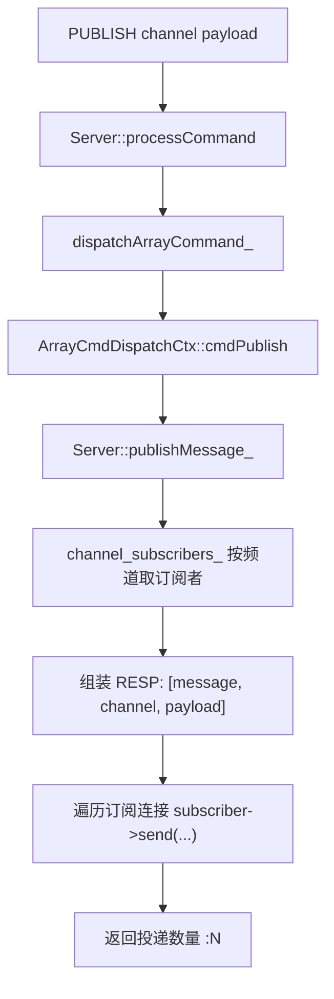

# SunKV Pub/Sub 最小闭环计划

## 目标
- 实现 `SUBSCRIBE/UNSUBSCRIBE/PUBLISH`，采用你确认的语义：
  - 订阅态仅允许 `SUBSCRIBE/UNSUBSCRIBE/PING/QUIT`（Redis-like）
  - 回包格式尽量兼容 Redis（`subscribe` / `unsubscribe` / `message` 数组）
- 保障连接断开时订阅关系自动清理，不引入明显回归。

## 改造范围
- 服务端主流程：[server/Server.h](/home/xhy/mycode/SunKV/server/Server.h)、[server/Server.cpp](/home/xhy/mycode/SunKV/server/Server.cpp)
- 命令分发：[server/ArrayCmdDispatch.cpp](/home/xhy/mycode/SunKV/server/ArrayCmdDispatch.cpp)、[server/ArrayCmdDispatch.h](/home/xhy/mycode/SunKV/server/ArrayCmdDispatch.h)
- 测试：[test/server/server_test_helper.h](/home/xhy/mycode/SunKV/test/server/server_test_helper.h)、新增 `test/server/server_pubsub_integration_test.cpp`
- 构建注册：[CMakeLists.txt](/home/xhy/mycode/SunKV/CMakeLists.txt)
- 文档（可选收尾）：[README.md](/home/xhy/mycode/SunKV/README.md)

## 设计与数据结构

- 在 `ConnParseState` 增加：`subscribed_channels`（连接当前订阅集合）。
- 在 `Server` 增加：`channel_subscribers`（`channel -> set<weak_ptr/connection_name>`），配套互斥锁。
- 订阅确认/取消确认/消息推送统一走 RESP 数组序列化 helper（避免拼接分散）。

## 实施步骤
1. **连接态与全局索引落地**
- 扩展 `ConnParseState` 与 `Server` 的 Pub/Sub 索引结构。
- 在 `onConnection` 断连分支补“按连接反查并清理频道订阅”。

2. **命令接入与回包格式**
- 在 `ArrayCmdDispatch` 注册并实现：`SUBSCRIBE`、`UNSUBSCRIBE`、`PUBLISH`。
- 回包对齐 Redis 风格：
  - 订阅确认：`["subscribe", channel, count]`
  - 取消确认：`["unsubscribe", channel, count]`
  - 消息投递：`["message", channel, payload]`
  - `PUBLISH` 返回投递数量整数。

3. **订阅态命令白名单约束**
- 在 `processCommand` 增加订阅态门禁：
  - 允许：`SUBSCRIBE/UNSUBSCRIBE/PING/QUIT`
  - 拒绝其他命令并返回 `ERR`（文案与 Redis 风格保持一致或接近）。

4. **测试与回归**
- 新增集成测试覆盖：
  - 基础流程：A 订阅，B 发布，A 收到 `message`。
  - 多频道与计数变化。
  - `UNSUBSCRIBE` 后不再收消息。
  - 订阅态执行普通命令被拒绝。
  - 断连后订阅清理（再次 `PUBLISH` 投递数正确）。
- 运行 server 标签关键测试与新增测试。

5. **文档收尾（简要）**
- README 增加 Pub/Sub 支持与限制说明，给一组最小复现命令。

## 风险与规避
- 并发一致性风险：广播与断连并发修改索引，统一通过 `Server` 内互斥保护并在发送前做连接可用性检查。
- 慢订阅者风险：复用现有 `TcpConnection` 背压/高水位策略，不新增绕过通道。
- 语义漂移风险：测试中固定校验 RESP 数组结构和计数字段。

最小闭环之外”，就是从“能跑通”走到“可长期用、可压测、可运维”的那一层能力。
你现在做的是 Pub/Sub MVP，外扩一般分这几类：

1) 语义完整性增强
PSUBSCRIBE/PUNSUBSCRIBE（模式订阅）
PUBSUB CHANNELS/NUMSUB/NUMPAT（观测订阅状态）
更细的订阅态兼容行为（与 Redis 更对齐）
2) 可靠性与背压治理
慢订阅者策略（限速、丢弃、断开策略可配置）
广播队列/批量发送策略优化（避免热点频道拖慢主线程）
更严格的并发安全与锁粒度优化（高并发发布场景）
3) 可观测性
指标：频道数、订阅连接数、每秒发布量、投递失败数、慢订阅者数
慢命令/慢投递日志
INFO 扩展输出 Pub/Sub 维度指标
4) 测试与工程化
多连接高并发发布压测
异常场景回归（断连、半包、背压、重连）
CI 增加 Pub/Sub 专项回归任务
5) 产品能力（更“像消息系统”）
持久化消息（当前 Pub/Sub 通常是瞬时）
离线投递（需要队列模型，已超出 Redis 经典 Pub/Sub）
ACK/重试/消费组（这其实更接近 Stream/Kafka 语义）